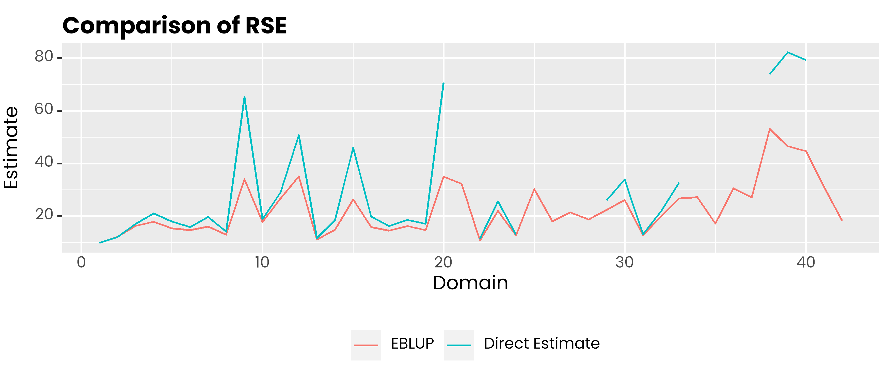
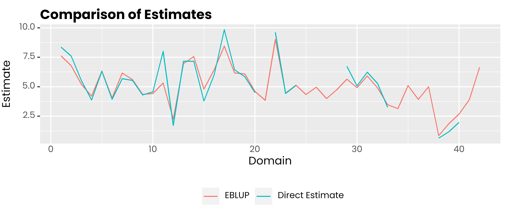

# saens

<!-- badges: start -->

[](https://CRAN.R-project.org/package=saens)
[](https://github.com/Alfrzlp/saens/actions/workflows/R-CMD-check.yaml)

<!-- badges: end -->

## Author

Ridson Al Farizal P, Azka Ubaidillah

## Maintainer

Ridson Al Farizal P <alfrzlp@gmail.com>

## Description

The goal of saens is to …

## Installation

You can install the development version of saens from
[GitHub](https://github.com/) with:

``` r
# install.packages("devtools")
devtools::install_github("Alfrzlp/saens")
```

or you can install cran version

``` r
install.packages(saens)
```

## Example

This is a basic example which shows you how to solve a common problem:

``` r
library(saens)
library(dplyr)
library(tidyr)
library(ggplot2)

windowsFonts(
  poppins = windowsFont('poppins')
)
```

``` r
glimpse(mys)
#> Rows: 42
#> Columns: 8
#> $ area  <int> 1, 2, 3, 4, 5, 6, 7, 8, 9, 10, 11, 12, 13, 14, 15, 16, 17, 18, 1…
#> $ y     <dbl> 8.359527, 7.599650, 5.514137, 3.869326, 6.305063, 3.926807, 5.68…
#> $ var   <dbl> 0.6618838, 0.8374691, 0.8822257, 0.6581716, 1.2788021, 0.3878004…
#> $ rse   <dbl> 9.732158, 12.041783, 17.033831, 20.966899, 17.935449, 15.858590,…
#> $ x1    <dbl> 124, 89, 57, 88, 141, 96, 146, 110, 58, 63, 35, 56, 84, 240, 123…
#> $ x2    <dbl> 24, 18, 19, 35, 46, 29, 57, 41, 18, 13, 12, 14, 38, 71, 33, 53, …
#> $ x3    <dbl> 14, 9, 5, 19, 29, 10, 34, 23, 11, 5, 9, 11, 35, 48, 29, 44, 37, …
#> $ clust <dbl> 3, 3, 4, 4, 3, 4, 3, 3, 3, 3, 3, 3, 3, 4, 3, 3, 3, 3, 4, 3, 3, 3…
```

### EBLUP Model

``` r
m1 <- eblupfh(y ~ x1 + x2 + x3, data = mys, vardir = "var", cluster = "clust")
#> ✔ Convergence after 6 iterations
#> → Method : REML
#> 
#> ── Coefficient ─────────────────────────────────────────────────────────────────
#>                   beta  Std.Error z-value   p-value    
#> (Intercept)  3.1077510  0.7697687  4.0373 5.408e-05 ***
#> x1          -0.0019323  0.0098886 -0.1954    0.8451    
#> x2           0.0555184  0.0614129  0.9040    0.3660    
#> x3           0.0335344  0.0580013  0.5782    0.5632    
#> ---
#> Signif. codes:  0 '***' 0.001 '**' 0.01 '*' 0.05 '.' 0.1 ' ' 1
```

### Comparison of estimates and RSE

``` r
mys$eblup_est <- m1$df_res$eblup
mys$eblup_rse <- m1$df_res$rse
  
glimpse(mys)
#> Rows: 42
#> Columns: 10
#> $ area      <int> 1, 2, 3, 4, 5, 6, 7, 8, 9, 10, 11, 12, 13, 14, 15, 16, 17, 1…
#> $ y         <dbl> 8.359527, 7.599650, 5.514137, 3.869326, 6.305063, 3.926807, …
#> $ var       <dbl> 0.6618838, 0.8374691, 0.8822257, 0.6581716, 1.2788021, 0.387…
#> $ rse       <dbl> 9.732158, 12.041783, 17.033831, 20.966899, 17.935449, 15.858…
#> $ x1        <dbl> 124, 89, 57, 88, 141, 96, 146, 110, 58, 63, 35, 56, 84, 240,…
#> $ x2        <dbl> 24, 18, 19, 35, 46, 29, 57, 41, 18, 13, 12, 14, 38, 71, 33, …
#> $ x3        <dbl> 14, 9, 5, 19, 29, 10, 34, 23, 11, 5, 9, 11, 35, 48, 29, 44, …
#> $ clust     <dbl> 3, 3, 4, 4, 3, 4, 3, 3, 3, 3, 3, 3, 3, 4, 3, 3, 3, 3, 4, 3, …
#> $ eblup_est <dbl> 7.612738, 6.782316, 5.187060, 4.201545, 6.323679, 4.048590, …
#> $ eblup_rse <dbl> 9.844182, 12.144869, 16.347620, 17.841554, 15.307573, 14.713…
```

``` r
mys %>% 
  select(area, rse, eblup_rse) %>% 
  pivot_longer(-1, names_to = "metode", values_to = "rse") %>%
  ggplot(aes(x = area, y = rse, col = metode)) +
  geom_line() +
    scale_color_discrete(
    labels = c('EBLUP', 'Direct Estimate')
  ) +
  labs(col = NULL, y = 'Estimate', x = 'Domain', title = 'Comparison of RSE') +
  theme(
    legend.position = 'bottom',
    text = element_text(family = 'poppins'),
    axis.ticks.x = element_blank(),
    plot.title = element_text(face = 2, vjust = 0),
    plot.subtitle = element_text(colour = 'gray30', vjust = 0)
  )
```



``` r
mys %>% 
  select(area, y, eblup_est) %>% 
  pivot_longer(-1, names_to = "metode", values_to = "rse") %>%
  ggplot(aes(x = area, y = rse, col = metode)) +
  geom_line() +
    scale_color_discrete(
    labels = c('EBLUP', 'Direct Estimate')
  ) +
  labs(col = NULL, y = 'Estimate', x = 'Domain', title = 'Comparison of Estimates') +
  theme(
    legend.position = 'bottom',
    text = element_text(family = 'poppins'),
    axis.ticks.x = element_blank(),
    plot.title = element_text(face = 2, vjust = 0),
    plot.subtitle = element_text(colour = 'gray30', vjust = 0)
  )
```


